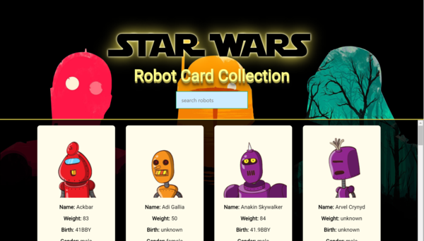
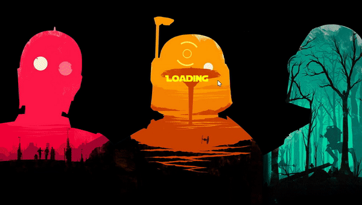
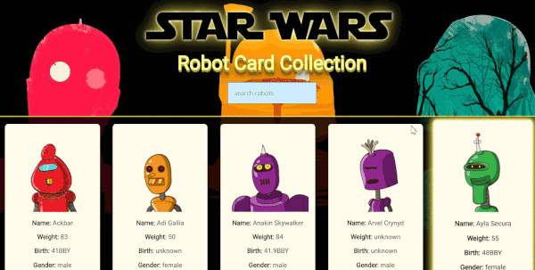

# Star Wars Robot Card Collection
`Live:` https://devchia254.github.io/swapi_robots/



A web app that displays the characters of Star Wars in the form of robots and cards. Each card displays data of each character in Star Wars.

## Info
- Star Wars character data retrieved from [SWAPI.](https://swapi.co/api/people/)
- React app was created using the command `npm install -g create-react-app`
- Each robot generated is unique to its character and fetched from the API:  `https://robohash.org/${id}?size=200x200`

## Purpose
The objective is to learn:-

- The fundamentals of how to fetch data from an API
- How to use AJAX and Promises
- Familiarise with React

## Features & Code Snippets
Below are some of the key features and code extracts of this web app.

### Fetch API
---


Before storing the character's data in the  `state`, an array  is created for listing all 10 URLs for fetching all the character's data.

Once all the URLs are listed then the JSON data is fetched by using `Promises.all` and stored in the `state`, within `api_data`.

##### App.js:
```javascript
componentDidMount() {
    const urlsArray = [];

    for(let i = 1; i < 10; i++) {
      urlsArray.push('https://swapi.co/api/people/?page=' + i.toString());
    }

    const charsData = [];

    const charsFetch = urlsArray.map(url => fetch(url)
        .then(res => res.json())
        .then(data => data.results.map(user => charsData.push(user)))
    );

    Promise.all(charsFetch)
      .then(results => this.setState({api_data: charsData}))
      .catch((err) => console.log('ERROR, please check', err))
 }
```

### Dynamic Search
----


`onSearchChange` is a function used for enabling the search feature in the `SearchBox` component.

The `searchfield` narrows down the results by using `array.filter()` method filter on the full list of star wars data. The filtered results are then reflected on the CardList component, simultaneously.

Sorting the star wars data and converting it to lowercase provides convenience, in terms of display and comparison of data.

##### App.js:
```javascript
onSearchChange = (event) => {
    this.setState({ searchfield: event.target.value })
}

render () {
	const { api_data, searchfield } = this.state;
	   
	const sortedData = api_data.sort((a, b) => a.name.localeCompare(b.name)); // Sorts fetched data
	
	const filteredData = sortedData.filter(person =>{
		return person.name.toLowerCase().includes(searchfield.toLowerCase()); // Converts all names to lowercase for searchfield
	})
}
```

### Fetch JSON data again:
----
Since the 'species' attribute provides a URL as a value, therefore JSON data must be fetched again from the URL value to get the 'species' value.

By using `this.props.species[0]`, the first value is retrieved from the URL then stored in the  `state` for the Card component.


##### Card.js:
```javascript
componentDidMount() {
    // SPECIES //
      fetch(this.props.species[0])
        .then(resp => resp.json())
        .then(json => this.setState({species: json.name}))
        .catch(() => this.setState({species: 'Species Unknown'}));
}
```

### Generate Character Info:
----
The CardList component accesses `api_data` from the `state` of the App component, through the use of `props` i.e. `filteredData`.

Once the `api_data` is accessed then each character's data is mapped into individual card. 

##### CardList.js:
```javascript
const CardList = ({ api_data }) => {

  const listPeople = api_data.map((user, i) => {
      return (
        <Card
          id = {i+=1}
          key={user.url}
          name={user.name}
          weight={user.mass}
          birth={user.birth_year}
          gender={user.gender}
          species={user.species}
        />
      );
    }
  )
  
  return (
    <div>
      {listPeople}
    </div>
  );
}
```

## NPM Dev Packages:

`gh-pages` was used to deploy the react app on Github Pages.

`react` , `react-dom` and `react-scripts`, were initiated from the create-react-app command.

`tachyons` is a package for styling the site with greater ease.


```json
"dependencies": {
    "gh-pages": "^2.0.1",
    "react": "^16.8.6",
    "react-dom": "^16.8.6",
    "react-scripts": "3.0.1",
    "tachyons": "^4.11.1"
  }
```
